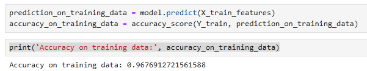
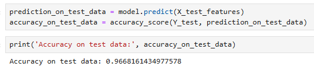

# Email Spam Classifier

This project demonstrates a machine learning approach to classifying emails as spam or ham (not spam). The project leverages Python, Jupyter Notebook, and machine learning libraries like `scikit-learn` to build and evaluate a predictive model.

---

## Project Structure

- **`email_spam_classifier.ipynb`**: The main Jupyter Notebook file containing all the steps for loading data, preprocessing, feature extraction, training the machine learning model, and evaluating its performance.
- **`Dataset/email_data.csv`**: The dataset used for training and testing the model.
- **`Snapshots/`**: Contains screenshots showing the model's accuracy on training and test datasets.

---

## Overview

Spam classification is a binary classification problem where the goal is to distinguish between spam and ham emails. This project uses a dataset of emails labeled as spam or ham and performs the following steps:
1. Preprocessing the text data (e.g., converting to lowercase, removing stop words).
2. Feature extraction using **TF-IDF Vectorizer**.
3. Training a **Logistic Regression** model.
4. Evaluating the model's performance using metrics like **accuracy**.
5. Making predictions on sample emails.

---

## Results

The following screenshots show the accuracy of the model on the training and test datasets:

### Training Data Accuracy


### Test Data Accuracy


- **Accuracy on Training Data**: Achieved 96.8% accuracy.
- **Accuracy on Test Data**: Achieved 96.7% accuracy.

---

## Dataset

The dataset used for this project is included in the repository for easy replication.

- **File**: [`Dataset/mail_data.csv`](Dataset/mail_data.csv)
- **Description**: The dataset contains labeled email data:
  - **Category**: `ham` (not spam) or `spam`.
  - **Message**: The text of the email.

---
## Example Output

Below are sample predictions made by the model:

### Example 1:
**Email**:
Hi Developers at Prabesh Rai, Your developer account is not compliant with one or more of our Developer Program Policies. See below for more information about your developer account’s status, and how to fix the issue.

**Prediction**: Ham mail

---

### Example 2:
**Email**:
Hi Prabesh! Lucia here 👋 I'm the manager at The Independent Film School. Ela is in production of her new feature film 109 Billion Followers so, for what may be the last week before she returns, I'm sending you one of my favorite Tip Tuesdays that she's written over the years. Hit reply if you have questions or need help!

**Prediction**: Ham mail

---

### Example 3:
**Email**:
Congratulations! You’ve been selected to receive a $1,000 gift card. Click the link below to claim your reward now! Offer expires in 24 hours.

**Prediction**: Spam mail

---

These examples show how the model processes emails and classifies them as `Ham mail` or `Spam mail` based on their content.

## Learning Outcomes

This project has been a valuable learning experience, and it helped me gain the following skills:

1. **Data Preprocessing**:
   - Learned how to clean and preprocess raw text data for machine learning tasks.
   - Applied techniques such as stop word removal, case normalization, and vectorization.

2. **Feature Engineering**:
   - Gained hands-on experience with TF-IDF Vectorization for transforming text into numerical features.

3. **Model Training and Evaluation**:
   - Learned to train a Logistic Regression model for binary classification.
   - Evaluated model performance using metrics such as accuracy, precision, and recall.

4. **Python Libraries**:
   - Strengthened my skills with `pandas`, `scikit-learn`, and `numpy`.

5. **Problem Solving**:
   - Developed a deeper understanding of how machine learning can solve practical problems like spam detection.

6. **Documentation**:
   - Improved my ability to document projects for better readability and collaboration.

As I continue to learn, I aim to explore advanced text classification techniques like **word embeddings**, **n-grams**, and **deep learning models**.

---

### Prerequisites:
- Python 3.7 or above
- Jupyter Notebook or JupyterLab installed


1. Clone the repository:
   ```
   https://github.com/Prabesh789/Email-spam-classifier.git
   ```
   
## Contact Information
Feel free to contact me for more details:
- **LinkedIn**: [https://www.linkedin.com/in/prabeshrai/]
- **Email**: [raiprabesh775@gmail.com]

